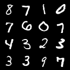

______________________________________________________________________

<div align="center">

# Diffusion Models

<a href="https://pytorch.org/get-started/locally/"></a>
<a href="https://pytorchlightning.ai/"></a>
<a href="https://hydra.cc/"></a>
<a href="https://github.com/ashleve/lightning-hydra-template"></a><br>

</div>

## Description

My implementation of Latent Diffusion Models. The codebase includes two samplers: DDPM and DDIM.

## How to run

Install dependencies

```bash
# clone project
git clone https://github.com/phamgialinhlx/diffusion-model
cd diffusion-model

# [OPTIONAL] create conda environment
conda create -n diffusion python=3.8 -y
conda activate diffusion

# install pytorch according to instructions
# https://pytorch.org/get-started/

# install requirements
pip install -r requirements.txt
```

Train model with default configuration

```bash
# train on CPU
python src/train_ae.py trainer=cpu
python src/train_diffusion.py trainer=cpu

# train on GPU (default)
python src/train_ae.py
python src/train_diffusion.py
```

You can override any parameter from command line like this

```bash
# train autoencoder on MNIST dataset
python src/train_ae.py datamodule=mnist
# train diffusion model using experiment config
python src/train_diffusion.py model=ddim_vqmodel_f32_celeba
```

## Results


<table>
  <tr>
    <td><br><p align="center">Original samples from MNIST dataset</p></td>
    <td><br><p align="center">Synthesis samples</p></td>
  </tr>
</table>


<table>
  <tr>
    <td><br><p align="center">Original samples from CelebA dataset</p></td>
    <td><br><p align="center">Synthesis samples</p></td>
  </tr>
</table>
